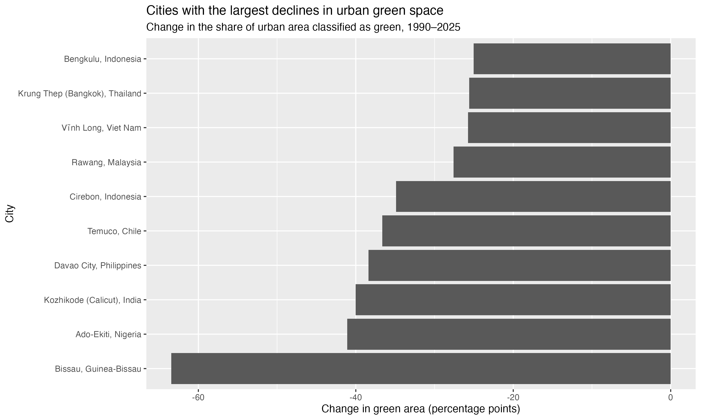
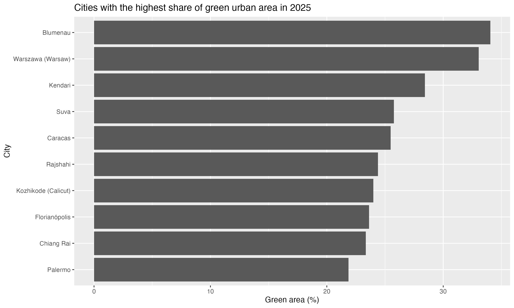

# TidyTuesday: Urban Green Space

This analysis explores urban green-space data from UN-Habitat as part
of TidyTuesday 2026-09-22.

The dataset contains city-level information on the share of urban area
classified as green and green space per capita across multiple years.

## Questions

I explored the following questions:

- Which citites have the highest percentage of green space in urban areas in most recent year available?
- Which cities experienced the largest decline in green space percentage between 1990 and 2025?
- Which cities experienced the largest increase in green space percentage between 1990 and 2025?

## Key Findings

### Cities with the largest declines in green-space share

The chart compares the change in the percentage of urban area classified
as green between 1990 and 2025. Negative values indicate a decline over
the period.

Bissau showed the largest decline among the cities included in this
comparison, with a substantially larger decrease than most other cities.

### Greenest cities in the latest year

This visualisation ranks cities by the percentage of their urban area
classified as green in the most recent year available.

## Tools

- R
- tidyverse
- dplyr
- tidyr
- ggplot2
- tidytuesdayR

## Data

The data comes from the TidyTuesday 2026-09-22 dataset on urban green
space, sourced from UN-Habitat.

Key variables used in the analysis include:

- `cityName`
- `countryOrTerritoryName`
- `year`
- `averageShareOfGreenAreaInCityUrbanAreaPct`
- `greenAreaPerCapitaM2`

## Files

- `analysis.R` — data cleaning, analysis and visualisation
- `figures/` — exported charts used in this README